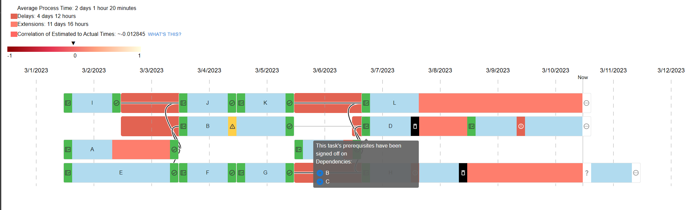

# pppp

Gerald Weinberg's PPPP come to life

The graph shows how delays and extensions can push other things back. The red lines to the left of tasks show how far
they've been pushed past the point in time they were expected to start. The pink boxes inside them show where tasks took
longer than anticipated once they were actually started.

Each Task starts with a box representing the prerequisites it has. These need to be approved before the task can begin.
Part of these prerequisites are criteria for how to tell when it is done.

Once an iteration is completed for a task, it undergoes a review. If it passes, there's a green review box added on the
end. If a minor revision is needed, a yellow review is shown and another iteration begins. If a major revision is
needed, a red box is shown. If an entire rebuild is necessary, a black box is shown and new prerequisites must be
approved. A delay can occur before such prerequisites are approved, and this is shown as another pink box.

The connecting lines show which tasks are dependent on which other tasks. This is useful because it makes it clear which
tasks pushed other tasks back, since they can't start unless all their prerequisites are ready.
